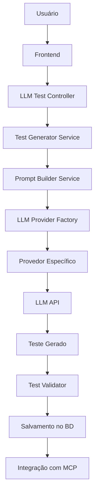

# 🧠 Arquitetura do Módulo LLM Test Generator

## 📋 Visão Geral

Este módulo permitirá que usuários criem testes automatizados utilizando diferentes provedores de LLM, com uma interface abstraída e sistema de gerenciamento de chaves API.

## 🏗️ Estrutura da Arquitetura

### 1. **Camada de Abstração LLM**
```
src/
├── llm-tests/
│   ├── interfaces/
│   │   ├── llm-provider.interface.ts
│   │   ├── test-generation.interface.ts
│   │   └── api-key-manager.interface.ts
│   ├── providers/
│   │   ├── openai.provider.ts
│   │   ├── anthropic.provider.ts
│   │   ├── gemini.provider.ts
│   │   └── base-llm.provider.ts
│   ├── services/
│   │   ├── llm-test-generator.service.ts
│   │   ├── api-key-manager.service.ts
│   │   ├── test-prompt-builder.service.ts
│   │   └── test-validator.service.ts
│   ├── controllers/
│   │   ├── llm-test-generator.controller.ts
│   │   └── api-keys.controller.ts
│   ├── entities/
│   │   ├── llm-provider-config.entity.ts
│   │   ├── generated-test.entity.ts
│   │   └── user-api-key.entity.ts
│   ├── dto/
│   │   ├── generate-test.dto.ts
│   │   ├── api-key.dto.ts
│   │   └── test-prompt.dto.ts
│   └── llm-tests.module.ts
```

### 2. **Interfaces Principais**

#### `LLMProvider Interface`
```typescript
interface LLMProvider {
  readonly name: string;
  readonly apiVersion: string;
  
  generateTest(prompt: TestPrompt): Promise<GeneratedTest>;
  validateApiKey(apiKey: string): Promise<boolean>;
  estimateTokens(prompt: string): number;
  getSupportedModels(): string[];
}
```

#### `TestGeneration Interface`
```typescript
interface TestGenerationRequest {
  targetUrl: string;
  testDescription: string;
  testType: 'e2e' | 'visual' | 'performance' | 'accessibility';
  llmProvider: string;
  model?: string;
  additionalContext?: string;
}
```

### 3. **Fluxo de Dados**



### 4. **Entidades do Banco de Dados**

#### `UserApiKey Entity`
```typescript
@Entity('user_api_keys')
export class UserApiKey {
  @PrimaryGeneratedColumn('uuid')
  id: string;

  @Column()
  userId: string;

  @Column()
  provider: string;

  @Column({ type: 'text' })
  encryptedApiKey: string;

  @Column({ default: true })
  isActive: boolean;

  @CreateDateColumn()
  createdAt: Date;

  @UpdateDateColumn()
  updatedAt: Date;
}
```

#### `GeneratedTest Entity`
```typescript
@Entity('generated_tests')
export class GeneratedTest {
  @PrimaryGeneratedColumn('uuid')
  id: string;

  @Column()
  userId: string;

  @Column()
  name: string;

  @Column({ type: 'text' })
  description: string;

  @Column()
  llmProvider: string;

  @Column()
  model: string;

  @Column({ type: 'json' })
  originalPrompt: any;

  @Column({ type: 'json' })
  generatedCode: any;

  @Column({ type: 'json' })
  mcpCommands: any;

  @Column({ default: 'draft' })
  status: 'draft' | 'validated' | 'active' | 'failed';

  @CreateDateColumn()
  createdAt: Date;
}
```

### 5. **Sistema de Criptografia para API Keys**

```typescript
@Injectable()
export class ApiKeyManagerService {
  private readonly encryptionKey = process.env.API_KEY_ENCRYPTION_SECRET;

  async storeApiKey(userId: string, provider: string, apiKey: string): Promise<void> {
    const encryptedKey = this.encrypt(apiKey);
    // Salvar no banco...
  }

  async getDecryptedApiKey(userId: string, provider: string): Promise<string> {
    // Buscar no banco e descriptografar...
  }

  private encrypt(text: string): string {
    // Implementação de criptografia AES-256
  }

  private decrypt(encryptedText: string): string {
    // Implementação de descriptografia
  }
}
```

### 6. **Factory Pattern para Provedores LLM**

```typescript
@Injectable()
export class LLMProviderFactory {
  constructor(
    private openaiProvider: OpenAIProvider,
    private anthropicProvider: AnthropicProvider,
    private geminiProvider: GeminiProvider,
  ) {}

  createProvider(providerName: string): LLMProvider {
    switch (providerName.toLowerCase()) {
      case 'openai':
        return this.openaiProvider;
      case 'anthropic':
        return this.anthropicProvider;
      case 'gemini':
        return this.geminiProvider;
      default:
        throw new Error(`Provedor não suportado: ${providerName}`);
    }
  }

  getAvailableProviders(): string[] {
    return ['openai', 'anthropic', 'gemini'];
  }
}
```

### 7. **Integração com MCP Playwright**

```typescript
@Injectable()
export class MCPIntegrationService {
  async convertLLMTestToMCP(generatedTest: GeneratedTest): Promise<MCPCommands[]> {
    // Converter teste gerado para comandos MCP
    const mcpCommands = this.parseTestToMCPCommands(generatedTest.generatedCode);
    
    return mcpCommands.map(cmd => ({
      action: cmd.action,
      selector: cmd.selector,
      value: cmd.value,
      waitFor: cmd.waitFor,
      screenshot: cmd.screenshot
    }));
  }

  async executeMCPTest(commands: MCPCommands[]): Promise<TestExecutionResult> {
    // Executar comandos através do MCP
  }
}
```

### 8. **Sistema de Templates de Prompt**

```typescript
@Injectable()
export class TestPromptBuilderService {
  buildPrompt(request: TestGenerationRequest): TestPrompt {
    const basePrompt = this.getBasePrompt(request.testType);
    const contextualPrompt = this.addContext(basePrompt, request);
    const mcpInstructions = this.addMCPInstructions(contextualPrompt);
    
    return {
      system: this.getSystemPrompt(),
      user: mcpInstructions,
      examples: this.getExamples(request.testType)
    };
  }

  private getSystemPrompt(): string {
    return `
      Você é um especialista em automação de testes web usando Playwright e MCP.
      Sua tarefa é gerar testes automatizados precisos e eficientes.
      
      INSTRUÇÕES:
      1. Use apenas comandos MCP válidos
      2. Inclua validações adequadas
      3. Adicione capturas de tela em pontos críticos
      4. Use seletores robustos
      5. Implemente tratamento de erros
    `;
  }
}
```

### 9. **Middleware de Validação**

```typescript
@Injectable()
export class TestValidatorService {
  async validateGeneratedTest(test: any): Promise<ValidationResult> {
    const validations = [
      this.validateMCPCommands(test.mcpCommands),
      this.validateSelectors(test.selectors),
      this.validateTestStructure(test.structure),
      this.validateSyntax(test.code)
    ];

    const results = await Promise.all(validations);
    
    return {
      isValid: results.every(r => r.isValid),
      errors: results.flatMap(r => r.errors),
      warnings: results.flatMap(r => r.warnings)
    };
  }
}
```

### 10. **Frontend Components**

#### Configuração de Provedores LLM
```typescript
// LLMProviderConfig.tsx
interface LLMProviderConfigProps {
  providers: LLMProvider[];
  onConfigSave: (config: ProviderConfig) => void;
}

export const LLMProviderConfig: React.FC<LLMProviderConfigProps> = ({ providers, onConfigSave }) => {
  // Interface para configurar provedores e chaves API
};
```

#### Gerador de Testes
```typescript
// TestGenerator.tsx
interface TestGeneratorProps {
  onTestGenerated: (test: GeneratedTest) => void;
}

export const TestGenerator: React.FC<TestGeneratorProps> = ({ onTestGenerated }) => {
  // Interface para criar prompts e gerar testes
};
```

## 🔧 Implementação Técnica

### **Dependências Necessárias**

```json
{
  "dependencies": {
    "openai": "^4.0.0",
    "@anthropic-ai/sdk": "^0.20.0",
    "@google/generative-ai": "^0.11.0",
    "crypto": "^1.0.1",
    "class-transformer": "^0.5.1",
    "class-validator": "^0.14.0"
  }
}
```

### **Variáveis de Ambiente**

```env
# Criptografia
API_KEY_ENCRYPTION_SECRET=your-secret-key-32-chars

# Configurações LLM
DEFAULT_LLM_PROVIDER=openai
MAX_TOKENS_PER_REQUEST=4000
LLM_REQUEST_TIMEOUT=30000

# Rate Limiting
LLM_REQUESTS_PER_MINUTE=10
LLM_REQUESTS_PER_HOUR=100
```

## 🛡️ Segurança

1. **Criptografia de Chaves API**: AES-256 para armazenamento seguro
2. **Rate Limiting**: Limitação de requisições por usuário
3. **Validação de Input**: Sanitização de prompts e dados
4. **Auditoria**: Log de todas as operações LLM
5. **Permissões**: Sistema de roles para acesso aos recursos

## 📊 Monitoramento

```typescript
@Injectable()
export class LLMMetricsService {
  async trackGeneration(userId: string, provider: string, tokens: number, cost: number): Promise<void> {
    // Rastrear métricas de uso
  }

  async getUsageStats(userId: string, period: string): Promise<UsageStats> {
    // Retornar estatísticas de uso
  }
}
```

## 🚀 Roadmap de Implementação

### **Fase 1: Core Infrastructure**
- [ ] Interfaces e abstrações base
- [ ] Sistema de criptografia para API keys
- [ ] Entidades do banco de dados
- [ ] Factory pattern para provedores

### **Fase 2: Provedores LLM**
- [ ] Implementação OpenAI provider
- [ ] Implementação Anthropic provider
- [ ] Implementação Gemini provider
- [ ] Sistema de validação de API keys

### **Fase 3: Geração de Testes**
- [ ] Prompt builder service
- [ ] Test generator service
- [ ] Integração com MCP
- [ ] Sistema de validação

### **Fase 4: Frontend**
- [ ] Interface de configuração
- [ ] Gerador de testes
- [ ] Visualizador de resultados
- [ ] Dashboard de métricas

### **Fase 5: Otimizações**
- [ ] Cache de resultados
- [ ] Templates de prompt avançados
- [ ] Sistema de feedback
- [ ] Análise de qualidade dos testes

## 💡 Considerações de Design

1. **Extensibilidade**: Facilitar adição de novos provedores LLM
2. **Performance**: Cache e otimização de requisições
3. **Usabilidade**: Interface intuitiva para usuários não técnicos
4. **Confiabilidade**: Validação rigorosa dos testes gerados
5. **Escalabilidade**: Suporte a alto volume de requisições

---

**Próximos Passos**: Implementar o script de revisão e começar pela Fase 1 da arquitetura. 