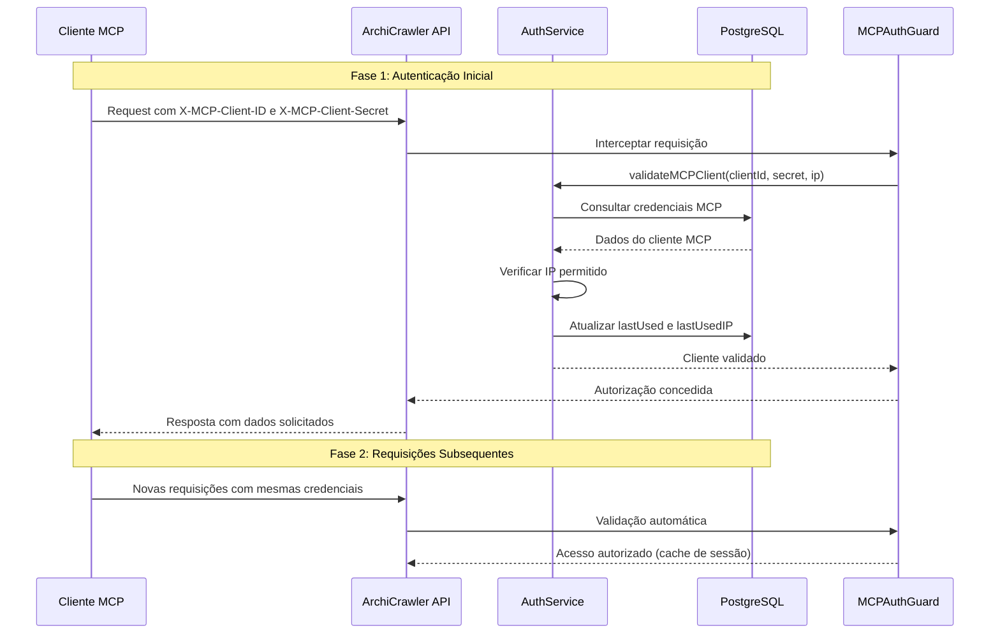

# Sistema de Autenticação MCP - ArchiCrawler

## Visão Geral

O ArchiCrawler implementa um sistema de autenticação robusto e flexível para clientes MCP (Model Context Protocol), oferecendo múltiplas camadas de segurança e controle de acesso granular. Este documento descreve formalmente os mecanismos de autenticação, autorização e gerenciamento de sessões para clientes MCP.

## Arquitetura de Autenticação

### 1. Modelo de Autenticação Híbrido

O sistema utiliza um modelo híbrido que combina:

- **Autenticação Baseada em Credenciais**: Client ID e Client Secret para identificação inicial
- **Controle de Acesso por IP**: Whitelist de endereços IP permitidos
- **Sistema de Permissões Granulares**: Controle fino sobre recursos acessíveis
- **Auditoria e Monitoramento**: Logs detalhados de acesso e uso

### 2. Fluxo de Autenticação



## Especificação Técnica

### 3. Credenciais MCP

#### 3.1 Estrutura das Credenciais

```typescript
interface MCPCredentials {
  clientId: string;      // Identificador único do cliente
  clientSecret: string;  // Chave secreta para autenticação
}
```

#### 3.2 Formato dos Headers HTTP

```http
X-MCP-Client-ID: mcp_archicrawler_default_client_2024
X-MCP-Client-Secret: archicrawler_mcp_secret_key_2024_default_client_secure
```

### 4. Processo de Autenticação Detalhado

#### 4.1 Validação de Credenciais

1. **Extração de Headers**: O sistema extrai os headers `X-MCP-Client-ID` e `X-MCP-Client-Secret`
2. **Consulta ao Banco**: Busca no PostgreSQL por credenciais correspondentes
3. **Verificação de Status**: Confirma se o cliente está ativo (`isActive: true`)
4. **Validação de IP**: Verifica se o IP do cliente está na whitelist (se configurada)
5. **Atualização de Logs**: Registra último acesso e IP utilizado

#### 4.2 Algoritmo de Validação

```typescript
async validateMCPClient(
  clientId: string,
  clientSecret: string,
  clientIP?: string
): Promise<MCPClient | null> {
  // 1. Buscar cliente no banco
  const client = await this.mcpClientRepository.findOne({
    where: { clientId, clientSecret, isActive: true }
  });

  if (!client) return null;

  // 2. Verificar IP se configurado
  if (client.allowedIPs?.length > 0 && clientIP) {
    if (!client.allowedIPs.includes(clientIP)) {
      this.logger.warn(`IP não autorizado: ${clientIP}`);
      return null;
    }
  }

  // 3. Atualizar logs de acesso
  await this.mcpClientRepository.update(client.id, {
    lastUsed: new Date(),
    lastUsedIP: clientIP,
  });

  return client;
}
```

### 5. Gerenciamento de Sessões

#### 5.1 Modelo Stateless

O sistema MCP utiliza um modelo **stateless**, onde:

- **Não há sessões persistentes**: Cada requisição é validada independentemente
- **Autenticação por requisição**: Headers devem ser enviados em todas as chamadas
- **Cache de validação**: Otimizações internas para performance
- **Timeout automático**: Não há expiração de sessão, apenas validação contínua

#### 5.2 Vantagens do Modelo Stateless

1. **Escalabilidade**: Não requer armazenamento de estado no servidor
2. **Simplicidade**: Implementação mais direta para clientes
3. **Confiabilidade**: Não há problemas de sincronização de sessão
4. **Segurança**: Cada requisição é validada independentemente

### 6. Sistema de Permissões

#### 6.1 Estrutura de Permissões

```typescript
interface MCPPermissions {
  permissions: string[];  // Array de permissões granulares
}

// Exemplos de permissões
const permissionExamples = [
  '*',                    // Acesso total
  'mcp:*',               // Todos os recursos MCP
  'mcp:read',            // Apenas leitura MCP
  'playwright:*',        // Todos os comandos Playwright
  'playwright:navigate', // Apenas navegação
  'playwright:screenshot', // Apenas screenshots
  'scraper:*',           // Todos os recursos de scraping
  'scraper:execute'      // Apenas execução de scraping
];
```

#### 6.2 Algoritmo de Verificação de Permissões

```typescript
hasPermission(permissions: string[], requiredPermission: string): boolean {
  // Permissão total
  if (permissions.includes('*')) return true;
  
  // Permissão exata
  if (permissions.includes(requiredPermission)) return true;
  
  // Permissão com wildcard
  const wildcardPermissions = permissions.filter(p => p.endsWith('*'));
  for (const wildcardPerm of wildcardPermissions) {
    const prefix = wildcardPerm.slice(0, -1);
    if (requiredPermission.startsWith(prefix)) return true;
  }
  
  return false;
}
```

### 7. Controle de Acesso por IP

#### 7.1 Configuração de IPs Permitidos

```typescript
interface IPWhitelist {
  allowedIPs: string[];  // Lista de IPs ou ranges permitidos
}

// Exemplos de configuração
const ipExamples = [
  '127.0.0.1',          // Localhost IPv4
  '::1',                // Localhost IPv6
  'localhost',          // Hostname local
  '192.168.1.0/24',     // Range de rede local
  '10.0.0.0/8'          // Range de rede privada
];
```

#### 7.2 Validação de IP

O sistema suporta:
- **IPs específicos**: Validação exata
- **Ranges CIDR**: Suporte a notação CIDR (futuro)
- **Hostnames**: Resolução de nomes (localhost)
- **IPv4 e IPv6**: Suporte completo a ambos os protocolos

## Implementação Prática

### 8. Configuração de Cliente MCP

#### 8.1 Criação de Cliente via API

```http
POST /auth/mcp-clients
Authorization: Bearer <jwt-token>
Content-Type: application/json

{
  "name": "Meu Cliente MCP",
  "permissions": ["mcp:*", "playwright:*", "scraper:read"],
  "allowedIPs": ["127.0.0.1", "192.168.1.100"]
}
```

#### 8.2 Resposta da Criação

```json
{
  "success": true,
  "message": "Cliente MCP criado com sucesso",
  "client": {
    "id": "uuid-generated",
    "name": "Meu Cliente MCP",
    "clientId": "mcp_generated_client_id",
    "clientSecret": "generated_secret_key",
    "permissions": ["mcp:*", "playwright:*", "scraper:read"],
    "allowedIPs": ["127.0.0.1", "192.168.1.100"]
  },
  "warning": "Guarde estas credenciais com segurança. Elas não serão mostradas novamente."
}
```

### 9. Uso do Cliente MCP

#### 9.1 Autenticação em Requisições

```http
GET /auth/test-mcp
X-MCP-Client-ID: mcp_generated_client_id
X-MCP-Client-Secret: generated_secret_key
```

#### 9.2 Uso de Serviços MCP

```http
POST /mcp/playwright/navigate
X-MCP-Client-ID: mcp_generated_client_id
X-MCP-Client-Secret: generated_secret_key
Content-Type: application/json

{
  "url": "https://example.com",
  "waitUntil": "networkidle"
}
```

### 10. Implementação em Diferentes Linguagens

#### 10.1 JavaScript/Node.js

```javascript
class MCPClient {
  constructor(clientId, clientSecret, baseURL = 'http://localhost:3001') {
    this.clientId = clientId;
    this.clientSecret = clientSecret;
    this.baseURL = baseURL;
    this.headers = {
      'X-MCP-Client-ID': clientId,
      'X-MCP-Client-Secret': clientSecret,
      'Content-Type': 'application/json'
    };
  }

  async validateAuth() {
    const response = await fetch(`${this.baseURL}/auth/test-mcp`, {
      method: 'GET',
      headers: this.headers
    });
    return response.json();
  }

  async navigate(url, options = {}) {
    const response = await fetch(`${this.baseURL}/mcp/playwright/navigate`, {
      method: 'POST',
      headers: this.headers,
      body: JSON.stringify({ url, ...options })
    });
    return response.json();
  }

  async screenshot(options = {}) {
    const response = await fetch(`${this.baseURL}/mcp/playwright/screenshot`, {
      method: 'POST',
      headers: this.headers,
      body: JSON.stringify(options)
    });
    return response.json();
  }
}

// Uso
const client = new MCPClient(
  'mcp_archicrawler_default_client_2024',
  'archicrawler_mcp_secret_key_2024_default_client_secure'
);

// Validar autenticação
const authResult = await client.validateAuth();
console.log('Autenticação:', authResult);

// Navegar para uma página
const navResult = await client.navigate('https://example.com');
console.log('Navegação:', navResult);
```

#### 10.2 Python

```python
import requests
import json

class MCPClient:
    def __init__(self, client_id, client_secret, base_url='http://localhost:3001'):
        self.client_id = client_id
        self.client_secret = client_secret
        self.base_url = base_url
        self.headers = {
            'X-MCP-Client-ID': client_id,
            'X-MCP-Client-Secret': client_secret,
            'Content-Type': 'application/json'
        }
    
    def validate_auth(self):
        """Validar autenticação MCP"""
        response = requests.get(
            f'{self.base_url}/auth/test-mcp',
            headers=self.headers
        )
        return response.json()
    
    def navigate(self, url, **options):
        """Navegar para uma URL"""
        data = {'url': url, **options}
        response = requests.post(
            f'{self.base_url}/mcp/playwright/navigate',
            headers=self.headers,
            json=data
        )
        return response.json()
    
    def screenshot(self, **options):
        """Capturar screenshot"""
        response = requests.post(
            f'{self.base_url}/mcp/playwright/screenshot',
            headers=self.headers,
            json=options
        )
        return response.json()

# Uso
client = MCPClient(
    'mcp_archicrawler_default_client_2024',
    'archicrawler_mcp_secret_key_2024_default_client_secure'
)

# Validar autenticação
auth_result = client.validate_auth()
print('Autenticação:', auth_result)

# Navegar para uma página
nav_result = client.navigate('https://example.com')
print('Navegação:', nav_result)
```

#### 10.3 cURL/Bash

```bash
#!/bin/bash

# Configuração
CLIENT_ID="mcp_archicrawler_default_client_2024"
CLIENT_SECRET="archicrawler_mcp_secret_key_2024_default_client_secure"
BASE_URL="http://localhost:3001"

# Headers comuns
HEADERS=(
    -H "X-MCP-Client-ID: $CLIENT_ID"
    -H "X-MCP-Client-Secret: $CLIENT_SECRET"
    -H "Content-Type: application/json"
)

# Função para validar autenticação
validate_auth() {
    echo "🔐 Validando autenticação MCP..."
    curl -s "${HEADERS[@]}" "$BASE_URL/auth/test-mcp" | jq '.'
}

# Função para navegar
navigate() {
    local url=$1
    echo "🌐 Navegando para: $url"
    curl -s "${HEADERS[@]}" \
        -d "{\"url\": \"$url\"}" \
        "$BASE_URL/mcp/playwright/navigate" | jq '.'
}

# Função para screenshot
screenshot() {
    echo "📸 Capturando screenshot..."
    curl -s "${HEADERS[@]}" \
        -d "{\"fullPage\": true}" \
        "$BASE_URL/mcp/playwright/screenshot" | jq '.'
}

# Uso
validate_auth
navigate "https://example.com"
screenshot
```

## Segurança e Boas Práticas

### 11. Recomendações de Segurança

#### 11.1 Gerenciamento de Credenciais

1. **Armazenamento Seguro**: Nunca hardcode credenciais no código
2. **Variáveis de Ambiente**: Use variáveis de ambiente para credenciais
3. **Rotação Regular**: Implemente rotação periódica de credenciais
4. **Princípio do Menor Privilégio**: Conceda apenas permissões necessárias

#### 11.2 Configuração de Rede

1. **Whitelist de IPs**: Configure IPs permitidos sempre que possível
2. **HTTPS**: Use sempre HTTPS em produção
3. **Firewall**: Configure firewall para restringir acesso
4. **VPN**: Use VPN para acesso remoto seguro

#### 11.3 Monitoramento e Auditoria

1. **Logs de Acesso**: Monitore logs de acesso regularmente
2. **Alertas**: Configure alertas para tentativas de acesso suspeitas
3. **Análise de Padrões**: Analise padrões de uso para detectar anomalias
4. **Backup de Logs**: Mantenha backup dos logs de auditoria

### 12. Tratamento de Erros

#### 12.1 Códigos de Erro Comuns

| Código | Descrição | Ação Recomendada |
|--------|-----------|------------------|
| 401 | Credenciais inválidas | Verificar Client ID e Secret |
| 403 | IP não autorizado | Verificar whitelist de IPs |
| 403 | Permissão insuficiente | Verificar permissões do cliente |
| 404 | Cliente não encontrado | Verificar se cliente existe |
| 500 | Erro interno | Contatar suporte técnico |

#### 12.2 Exemplo de Tratamento de Erros

```javascript
class MCPClient {
  async makeRequest(endpoint, options = {}) {
    try {
      const response = await fetch(`${this.baseURL}${endpoint}`, {
        headers: this.headers,
        ...options
      });

      if (!response.ok) {
        const error = await response.json();
        throw new MCPError(response.status, error.message, error);
      }

      return await response.json();
    } catch (error) {
      if (error instanceof MCPError) {
        throw error;
      }
      throw new MCPError(500, 'Erro de conexão', { originalError: error });
    }
  }
}

class MCPError extends Error {
  constructor(status, message, details = {}) {
    super(message);
    this.name = 'MCPError';
    this.status = status;
    this.details = details;
  }
}
```

## Credenciais Padrão

### 13. Clientes MCP Pré-configurados

#### 13.1 Cliente Padrão (Produção)

```
Client ID: mcp_archicrawler_default_client_2024
Client Secret: archicrawler_mcp_secret_key_2024_default_client_secure
Permissões: mcp:*, playwright:*, scraper:*
IPs Permitidos: 127.0.0.1, ::1, localhost
```

#### 13.2 Cliente de Desenvolvimento

```
Client ID: mcp_dev_client_archicrawler_2024
Client Secret: dev_mcp_secret_archicrawler_2024_development_only
Permissões: mcp:read, playwright:navigate, playwright:screenshot, playwright:click
IPs Permitidos: 127.0.0.1, ::1, localhost, 192.168.1.0/24
```

## Conclusão

O sistema de autenticação MCP do ArchiCrawler oferece uma solução robusta e flexível para controle de acesso a recursos de automação web. Através de um modelo stateless com validação por requisição, o sistema garante segurança sem comprometer a performance ou escalabilidade.

A implementação de permissões granulares, controle de IP e auditoria completa fornece as ferramentas necessárias para um ambiente de produção seguro e confiável.

Para suporte técnico ou questões sobre implementação, consulte a documentação da API em `/api` ou entre em contato com a equipe de desenvolvimento.

---

**Versão do Documento**: 1.0  
**Data de Criação**: 28/05/2025  
**Última Atualização**: 28/05/2025  
**Autor**: ArchiCrawler Development Team 