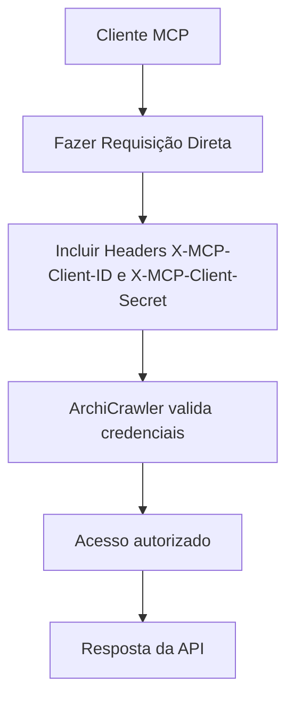
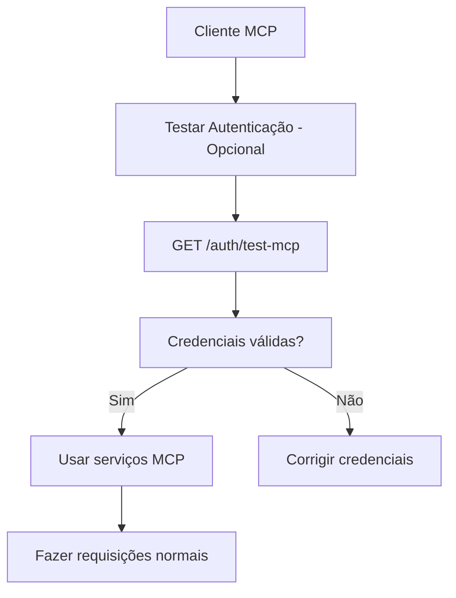

# Fluxo de Autenticação MCP - Perguntas e Respostas

## ❓ Pergunta Principal

**"Para consumir o cliente MCP deve primeiro realizar login, e depois enviar os tokens na requisição? Como vai manter a seção do meu cliente autenticado no MCP?"**

## ✅ Resposta Detalhada

### 🔐 **NÃO é necessário fazer login primeiro!**

O sistema MCP do ArchiCrawler utiliza um modelo de autenticação **diferente** do JWT tradicional. Aqui está como funciona:

## 📋 Comparação dos Métodos de Autenticação

| Aspecto | JWT (Web/Mobile) | MCP (Clientes MCP) |
|---------|------------------|-------------------|
| **Login Inicial** | ✅ Necessário | ❌ Não necessário |
| **Credenciais** | username/password | clientId/clientSecret |
| **Token** | JWT temporário | Credenciais permanentes |
| **Headers** | `Authorization: Bearer <token>` | `X-MCP-Client-ID` + `X-MCP-Client-Secret` |
| **Sessão** | Stateful (24h) | Stateless (permanente) |
| **Renovação** | Necessária | Não necessária |

## 🔄 Fluxo Correto para Clientes MCP

### Método 1: Uso Direto (Recomendado)



**Exemplo Prático:**

```bash
# Não precisa de login! Vai direto para o serviço
curl -X POST http://localhost:3001/mcp/playwright/navigate \
  -H "X-MCP-Client-ID: mcp_archicrawler_default_client_2024" \
  -H "X-MCP-Client-Secret: archicrawler_mcp_secret_key_2024_default_client_secure" \
  -H "Content-Type: application/json" \
  -d '{"url": "https://example.com"}'
```

### Método 2: Validação Opcional (Para Testes)



**Exemplo com Validação:**

```bash
# 1. Testar credenciais (opcional)
curl -X GET http://localhost:3001/auth/test-mcp \
  -H "X-MCP-Client-ID: mcp_archicrawler_default_client_2024" \
  -H "X-MCP-Client-Secret: archicrawler_mcp_secret_key_2024_default_client_secure"

# 2. Se válido, usar serviços normalmente
curl -X POST http://localhost:3001/mcp/playwright/screenshot \
  -H "X-MCP-Client-ID: mcp_archicrawler_default_client_2024" \
  -H "X-MCP-Client-Secret: archicrawler_mcp_secret_key_2024_default_client_secure" \
  -H "Content-Type: application/json" \
  -d '{"fullPage": true}'
```

## 🔧 Como Manter a "Sessão" Autenticada

### ⚡ Modelo Stateless - Sem Sessão Tradicional

O sistema MCP **não mantém sessões** no sentido tradicional. Em vez disso:

1. **Cada requisição é independente**: Credenciais são validadas a cada chamada
2. **Sem expiração**: Credenciais MCP não expiram (até serem revogadas)
3. **Sem renovação**: Não há necessidade de renovar tokens
4. **Performance otimizada**: Cache interno para validações rápidas

### 🏗️ Implementação de Cliente com "Sessão Simulada"

Embora não haja sessão real, você pode implementar uma classe que simule isso:

```javascript
class MCPSession {
  constructor(clientId, clientSecret, baseURL = 'http://localhost:3001') {
    this.clientId = clientId;
    this.clientSecret = clientSecret;
    this.baseURL = baseURL;
    this.isAuthenticated = false;
    this.lastValidation = null;
    
    // Headers que serão usados em todas as requisições
    this.headers = {
      'X-MCP-Client-ID': clientId,
      'X-MCP-Client-Secret': clientSecret,
      'Content-Type': 'application/json'
    };
  }

  // Método para "inicializar sessão" (validar credenciais)
  async connect() {
    try {
      const response = await fetch(`${this.baseURL}/auth/test-mcp`, {
        method: 'GET',
        headers: this.headers
      });

      if (response.ok) {
        this.isAuthenticated = true;
        this.lastValidation = new Date();
        console.log('✅ Sessão MCP estabelecida com sucesso');
        return await response.json();
      } else {
        this.isAuthenticated = false;
        throw new Error('Falha na autenticação MCP');
      }
    } catch (error) {
      this.isAuthenticated = false;
      console.error('❌ Erro ao conectar:', error.message);
      throw error;
    }
  }

  // Método para verificar se está "conectado"
  isConnected() {
    return this.isAuthenticated;
  }

  // Método genérico para fazer requisições
  async request(endpoint, options = {}) {
    // Opcional: verificar se foi validado recentemente
    if (!this.isAuthenticated) {
      console.warn('⚠️ Sessão não validada. Conecte primeiro com connect()');
    }

    const response = await fetch(`${this.baseURL}${endpoint}`, {
      headers: this.headers,
      ...options
    });

    if (!response.ok) {
      const error = await response.json();
      throw new Error(`Erro ${response.status}: ${error.message}`);
    }

    return await response.json();
  }

  // Métodos específicos para serviços MCP
  async navigate(url, options = {}) {
    return await this.request('/mcp/playwright/navigate', {
      method: 'POST',
      body: JSON.stringify({ url, ...options })
    });
  }

  async screenshot(options = {}) {
    return await this.request('/mcp/playwright/screenshot', {
      method: 'POST',
      body: JSON.stringify(options)
    });
  }

  async click(selector) {
    return await this.request('/mcp/playwright/click', {
      method: 'POST',
      body: JSON.stringify({ selector })
    });
  }

  // Método para "desconectar" (apenas local)
  disconnect() {
    this.isAuthenticated = false;
    this.lastValidation = null;
    console.log('🔌 Sessão MCP desconectada');
  }
}

// Uso da "sessão"
async function exemploUso() {
  const session = new MCPSession(
    'mcp_archicrawler_default_client_2024',
    'archicrawler_mcp_secret_key_2024_default_client_secure'
  );

  try {
    // 1. "Conectar" (validar credenciais)
    await session.connect();
    
    // 2. Usar serviços normalmente
    await session.navigate('https://example.com');
    await session.screenshot({ fullPage: true });
    await session.click('button#submit');
    
    // 3. "Desconectar" quando terminar
    session.disconnect();
    
  } catch (error) {
    console.error('Erro na sessão MCP:', error);
  }
}
```

### 🐍 Implementação em Python

```python
import requests
from datetime import datetime
import json

class MCPSession:
    def __init__(self, client_id, client_secret, base_url='http://localhost:3001'):
        self.client_id = client_id
        self.client_secret = client_secret
        self.base_url = base_url
        self.is_authenticated = False
        self.last_validation = None
        
        self.headers = {
            'X-MCP-Client-ID': client_id,
            'X-MCP-Client-Secret': client_secret,
            'Content-Type': 'application/json'
        }
    
    def connect(self):
        """Validar credenciais e 'estabelecer sessão'"""
        try:
            response = requests.get(
                f'{self.base_url}/auth/test-mcp',
                headers=self.headers
            )
            
            if response.status_code == 200:
                self.is_authenticated = True
                self.last_validation = datetime.now()
                print('✅ Sessão MCP estabelecida com sucesso')
                return response.json()
            else:
                self.is_authenticated = False
                raise Exception(f'Falha na autenticação: {response.status_code}')
                
        except Exception as error:
            self.is_authenticated = False
            print(f'❌ Erro ao conectar: {error}')
            raise
    
    def is_connected(self):
        """Verificar se está 'conectado'"""
        return self.is_authenticated
    
    def request(self, endpoint, method='GET', data=None):
        """Método genérico para requisições"""
        if not self.is_authenticated:
            print('⚠️ Sessão não validada. Conecte primeiro com connect()')
        
        url = f'{self.base_url}{endpoint}'
        
        if method.upper() == 'POST':
            response = requests.post(url, headers=self.headers, json=data)
        else:
            response = requests.get(url, headers=self.headers)
        
        if not response.ok:
            error = response.json()
            raise Exception(f"Erro {response.status_code}: {error.get('message', 'Erro desconhecido')}")
        
        return response.json()
    
    def navigate(self, url, **options):
        """Navegar para uma URL"""
        data = {'url': url, **options}
        return self.request('/mcp/playwright/navigate', 'POST', data)
    
    def screenshot(self, **options):
        """Capturar screenshot"""
        return self.request('/mcp/playwright/screenshot', 'POST', options)
    
    def click(self, selector):
        """Clicar em elemento"""
        return self.request('/mcp/playwright/click', 'POST', {'selector': selector})
    
    def disconnect(self):
        """'Desconectar' sessão"""
        self.is_authenticated = False
        self.last_validation = None
        print('🔌 Sessão MCP desconectada')

# Uso
def exemplo_uso():
    session = MCPSession(
        'mcp_archicrawler_default_client_2024',
        'archicrawler_mcp_secret_key_2024_default_client_secure'
    )
    
    try:
        # 1. "Conectar"
        session.connect()
        
        # 2. Usar serviços
        session.navigate('https://example.com')
        session.screenshot(fullPage=True)
        session.click('button#submit')
        
        # 3. "Desconectar"
        session.disconnect()
        
    except Exception as error:
        print(f'Erro na sessão MCP: {error}')
```

## 🔒 Segurança e Boas Práticas

### 1. **Armazenamento de Credenciais**

```bash
# ✅ Bom: Usar variáveis de ambiente
export MCP_CLIENT_ID="mcp_archicrawler_default_client_2024"
export MCP_CLIENT_SECRET="archicrawler_mcp_secret_key_2024_default_client_secure"

# ❌ Ruim: Hardcoded no código
const clientId = "mcp_archicrawler_default_client_2024"; // Não faça isso!
```

### 2. **Validação Periódica (Opcional)**

```javascript
class MCPSession {
  // ... código anterior ...

  async ensureConnected() {
    // Revalidar a cada 5 minutos (opcional)
    const fiveMinutes = 5 * 60 * 1000;
    const now = new Date();
    
    if (!this.lastValidation || (now - this.lastValidation) > fiveMinutes) {
      console.log('🔄 Revalidando credenciais MCP...');
      await this.connect();
    }
  }

  async request(endpoint, options = {}) {
    await this.ensureConnected(); // Validar antes de cada requisição
    // ... resto do código ...
  }
}
```

### 3. **Tratamento de Erros**

```javascript
class MCPSession {
  async request(endpoint, options = {}) {
    try {
      const response = await fetch(`${this.baseURL}${endpoint}`, {
        headers: this.headers,
        ...options
      });

      if (response.status === 401) {
        this.isAuthenticated = false;
        throw new Error('Credenciais MCP inválidas ou expiradas');
      }

      if (response.status === 403) {
        throw new Error('IP não autorizado ou permissão insuficiente');
      }

      if (!response.ok) {
        const error = await response.json();
        throw new Error(`Erro ${response.status}: ${error.message}`);
      }

      return await response.json();
    } catch (error) {
      console.error('❌ Erro na requisição MCP:', error.message);
      throw error;
    }
  }
}
```

## 📊 Resumo Comparativo

### JWT vs MCP Authentication

| Característica | JWT | MCP |
|----------------|-----|-----|
| **Processo Inicial** | Login → Token | Credenciais diretas |
| **Manutenção** | Renovar token | Nenhuma |
| **Headers** | `Authorization: Bearer <token>` | `X-MCP-Client-ID` + `X-MCP-Client-Secret` |
| **Expiração** | 24 horas | Sem expiração |
| **Complexidade** | Média | Baixa |
| **Uso Recomendado** | Apps web/mobile | Integrações de sistema |

## 🎯 Conclusão

**Para clientes MCP:**

1. ❌ **NÃO precisa fazer login primeiro**
2. ✅ **Use credenciais diretamente em cada requisição**
3. ✅ **Não há sessões reais - é stateless**
4. ✅ **Pode simular sessão localmente para organização**
5. ✅ **Credenciais não expiram (até serem revogadas)**

O modelo MCP é mais simples e direto que JWT, ideal para integrações de sistema onde você quer autenticação permanente sem a complexidade de gerenciar tokens temporários.

---

**Documentação Relacionada:**
- [MCP_AUTHENTICATION.md](./MCP_AUTHENTICATION.md) - Documentação completa
- [API Documentation](http://localhost:3001/api) - Swagger/OpenAPI 