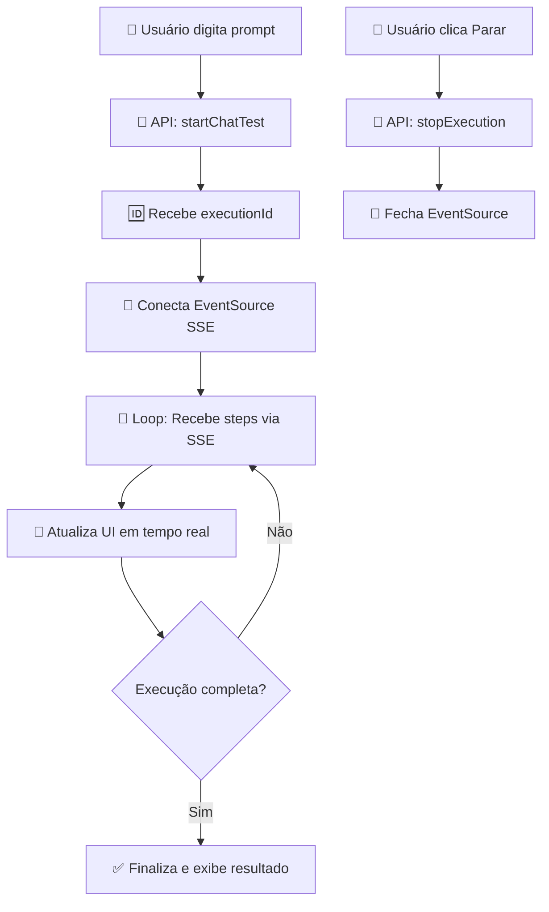

# 🎨 Integração Frontend - Sistema Dinâmico ArchiCrawler

## 🚀 **Visão Geral**

Este guia mostra como o frontend React interage com o novo sistema dinâmico do ArchiCrawler, proporcionando uma experiência conversacional similar ao Cursor Chat.

## 🏗️ **Arquitetura Frontend**

```
frontend/src/
├── services/
│   └── dynamic-test-api.ts          # 📡 API client para sistema dinâmico
├── hooks/
│   └── useDynamicTest.ts           # 🎣 Hook para gerenciar estado SSE
├── components/LLMTests/
│   └── DynamicTestChat.tsx         # 💬 Interface de chat principal
├── pages/
│   └── DynamicTestPage.tsx         # 📄 Página completa do sistema
```

## 📡 **1. Serviço de API (dynamic-test-api.ts)**

### **Principais Funcionalidades:**
```typescript
export class DynamicTestApiService {
  // 🚀 Inicia teste dinâmico
  async startChatTest(request: ChatTestRequest): Promise<ChatResponse>
  
  // 📡 Cria stream SSE para acompanhar execução
  createExecutionStream(executionId: string): EventSource
  
  // 🛑 Para execução em andamento
  async stopExecution(executionId: string): Promise<ChatResponse>
  
  // 🔑 Configura API keys LLM
  async setApiKey(provider: string, apiKey: string): Promise<void>
}
```

### **Exemplo de Uso:**
```typescript
import { dynamicTestApi } from '../services/dynamic-test-api';

// Iniciar teste
const response = await dynamicTestApi.startChatTest({
  message: "Teste se o login funciona no GitHub",
  targetUrl: "https://github.com/login",
  llmProvider: "openai",
  model: "gpt-4"
});

// Conectar ao stream
const eventSource = dynamicTestApi.createExecutionStream(response.executionId);
eventSource.onmessage = (event) => {
  const step = JSON.parse(event.data);
  console.log('Novo passo:', step.description);
};
```

## 🎣 **2. Hook Personalizado (useDynamicTest.ts)**

### **Estado Gerenciado:**
```typescript
interface DynamicTestState {
  isExecuting: boolean;        // Se está executando
  executionId: string | null;  // ID da execução atual
  steps: AgentStepData[];      // Passos executados
  error: string | null;        // Erros
  currentStep: AgentStepData | null; // Passo atual
}
```

### **Métodos Disponíveis:**
```typescript
const {
  isExecuting,    // Estado atual
  steps,          // Histórico de passos
  error,          // Erros
  currentStep,    // Passo atual
  startTest,      // Iniciar teste
  stopTest,       // Parar teste
  clearState      // Limpar estado
} = useDynamicTest();
```

### **Exemplo de Implementação:**
```typescript
function TestComponent() {
  const { isExecuting, steps, startTest } = useDynamicTest();

  const handleStartTest = async () => {
    await startTest({
      message: "Teste login",
      targetUrl: "https://example.com",
      llmProvider: "openai"
    });
  };

  return (
    <div>
      <button onClick={handleStartTest} disabled={isExecuting}>
        {isExecuting ? 'Executando...' : 'Iniciar Teste'}
      </button>
      
      {steps.map(step => (
        <div key={step.id}>
          {step.description} - {step.confidence}%
        </div>
      ))}
    </div>
  );
}
```

## 💬 **3. Interface de Chat (DynamicTestChat.tsx)**

### **Recursos Principais:**
- ✅ Interface conversacional estilo ChatGPT
- ✅ Stream em tempo real de execução
- ✅ Screenshots automáticos
- ✅ Indicadores de confiança
- ✅ Controles para parar/continuar
- ✅ Configuração de API keys

### **Componentes Visuais:**
```typescript
// Header com status
<Paper>
  <SmartIcon /> ArchiCrawler Assistant
  {isExecuting && <LinearProgress />}
  <Chip label="Confiança: 85%" />
</Paper>

// Área de mensagens
<Box>
  {steps.map(step => (
    <StepMessage step={step} />
  ))}
</Box>

// Input area
<TextField 
  placeholder="Descreva o que você quer testar..."
  onKeyPress={handleEnter}
/>
<Button onClick={startTest}>Testar</Button>
```

### **Exemplo de Uso Simples:**
```tsx
import { DynamicTestChat } from '../components/LLMTests/DynamicTestChat';

function MyPage() {
  return (
    <div style={{ height: '100vh' }}>
      <DynamicTestChat />
    </div>
  );
}
```

## 📄 **4. Página Completa (DynamicTestPage.tsx)**

### **Layout Responsivo:**
- **Desktop:** Chat + Sidebar com guias
- **Mobile:** Layout vertical
- **Features:** Exemplos, características, alertas

### **Sidebar Informativo:**
```typescript
<Stack spacing={2}>
  <Card>🚀 Como Usar</Card>
  <Card>💡 Exemplos de Prompts</Card>  
  <Card>✨ Características Únicas</Card>
  <Alert>🔗 Integração com MCP</Alert>
  <Alert>🧪 Versão Beta</Alert>
</Stack>
```

## 🔄 **5. Fluxo de Interação Completo**

### **Passo a Passo:**



### **Implementação no Componente:**
```typescript
// 1. Usuário envia mensagem
const handleSendMessage = async () => {
  await startTest({
    message: userInput,
    targetUrl: 'https://example.com',
    llmProvider: 'openai'
  });
};

// 2. Hook gerencia SSE automaticamente
const { steps, isExecuting } = useDynamicTest();

// 3. UI atualiza em tempo real
{steps.map(step => (
  <motion.div key={step.id}>
    <Avatar color={step.success ? 'success' : 'error'} />
    <Typography>{step.description}</Typography>
    <Chip label={`${step.confidence}%`} />
    {step.screenshot && }
  </motion.div>
))}
```

## 🎨 **6. Customização Visual**

### **Temas e Cores:**
```typescript
// Cores baseadas no sucesso
sx={{ 
  bgcolor: step.success ? 'success.main' : 'error.main',
  color: step.confidence > 80 ? 'success' : 'warning'
}}

// Gradientes modernos
background: 'linear-gradient(135deg, #667eea 0%, #764ba2 100%)'

// Animações suaves
<motion.div
  initial={{ opacity: 0, y: 20 }}
  animate={{ opacity: 1, y: 0 }}
  transition={{ delay: index * 0.1 }}
>
```

### **Responsividade:**
```typescript
// Flexbox responsivo
sx={{ 
  display: 'flex', 
  flexDirection: { xs: 'column', lg: 'row' },
  gap: 3 
}}

// Tamanhos adaptativos
sx={{ 
  flex: { lg: 2 }, 
  minWidth: 0,
  height: { xs: '50vh', lg: 'calc(100vh - 200px)' }
}}
```

## 🚀 **7. Como Integrar em Projeto Existente**

### **Passo 1: Instalar Dependências**
```bash
npm install framer-motion  # Para animações
```

### **Passo 2: Adicionar Serviços**
```typescript
// Em app.tsx ou index.tsx
import { dynamicTestApi } from './services/dynamic-test-api';
```

### **Passo 3: Adicionar Rota**
```typescript
// Em rotas
import { DynamicTestPage } from './pages/DynamicTestPage';

<Route path="/dynamic-tests" component={DynamicTestPage} />
```

### **Passo 4: Adicionar ao Menu**
```typescript
<NavLink to="/dynamic-tests">
  <SmartIcon /> Testes Dinâmicos
</NavLink>
```

## 🔧 **8. Configuração Avançada**

### **Customizar API Base URL:**
```typescript
// Em dynamic-test-api.ts
const baseURL = process.env.REACT_APP_API_URL || 'http://localhost:3000';
```

### **Adicionar Interceptors:**
```typescript
// Para autenticação automática
axios.interceptors.request.use(config => {
  const token = localStorage.getItem('auth_token');
  if (token) {
    config.headers.Authorization = `Bearer ${token}`;
  }
  return config;
});
```

### **Customizar Timeout SSE:**
```typescript
const eventSource = new EventSource(url, {
  withCredentials: true,
  timeout: 30000
});
```

## 📱 **9. Exemplo Completo Mínimo**

```tsx
import React from 'react';
import { Box, Button, TextField, Typography } from '@mui/material';
import { useDynamicTest } from '../hooks/useDynamicTest';

export const SimpleDynamicTest = () => {
  const [input, setInput] = React.useState('');
  const { isExecuting, steps, startTest } = useDynamicTest();

  const handleTest = () => {
    startTest({
      message: input,
      targetUrl: 'https://github.com/login',
      llmProvider: 'openai'
    });
  };

  return (
    <Box sx={{ p: 2 }}>
      <TextField
        fullWidth
        value={input}
        onChange={(e) => setInput(e.target.value)}
        placeholder="Descreva seu teste..."
        disabled={isExecuting}
      />
      
      <Button 
        onClick={handleTest} 
        disabled={isExecuting || !input}
        sx={{ mt: 2 }}
      >
        {isExecuting ? 'Executando...' : 'Testar'}
      </Button>

      {steps.map(step => (
        <Box key={step.id} sx={{ mt: 2, p: 2, border: 1 }}>
          <Typography variant="body2">
            {step.description} ({step.confidence}%)
          </Typography>
        </Box>
      ))}
    </Box>
  );
};
```

## 🎯 **Resultado Final**

Com esta integração, você terá:

✅ **Interface conversacional** estilo ChatGPT
✅ **Execução em tempo real** com SSE  
✅ **Feedback visual** com screenshots
✅ **Controle total** sobre execução
✅ **Experiência responsiva** em todos dispositivos
✅ **Fácil integração** com projetos existentes

**O frontend agora oferece a mesma experiência dinâmica e inteligente que o backend!** 🚀 